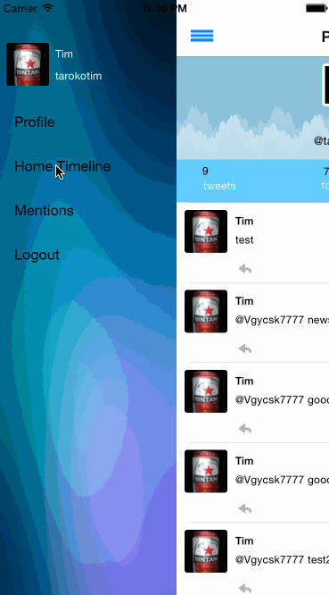

## Twitter [(raw)](https://gist.githubusercontent.com/timothy1ee/b9b1860c8ecb4b0b1c18/raw/2adc3f63677d81644e00245cee891eee88907767/gistfile1.md)

This is a basic twitter app to read and compose tweets the [Twitter API](https://apps.twitter.com/).

Time spent: `<24 hours spent>`

### Features

#### Required - 

- [*] Hamburger menu - Dragging anywhere in the view should reveal the menu. 
- [*] Hamburger menu - The menu should include links to your profile, the home timeline, and the mentions view.
- [*] Hamburger menu - The menu can look similar to the LinkedIn menu below or feel free to take liberty with the UI.
- [*] Profile page - Contains the user header view
- [*] Profile page - Contains a section with the users basic stats: # tweets, # following, # followers
- [*] Home Timeline - Tapping on a user image should bring up that user's profile page
- [*] User can tap on a tweet to view it, with controls to retweet, favorite, and reply.
- [*] User can retweet, favorite, and reply to the tweet directly from the timeline feed.

#### Optional

- [ ] Profile page - Implement the paging view for the user description.
- [ ] Profile page - As the paging view moves, increase the opacity of the background screen. See the actual Twitter app for this effect
- [ ] Profile page - Pulling down the profile page should blur and resize the header image.
- [ ] Account switching - Long press on tab bar to bring up Account view with animation
- [ ] Account switching - Tap account to switch to
- [ ] Account switching - Include a plus button to Add an Account
- [ ] Account switching - Swipe to delete an account

### Walkthrough

